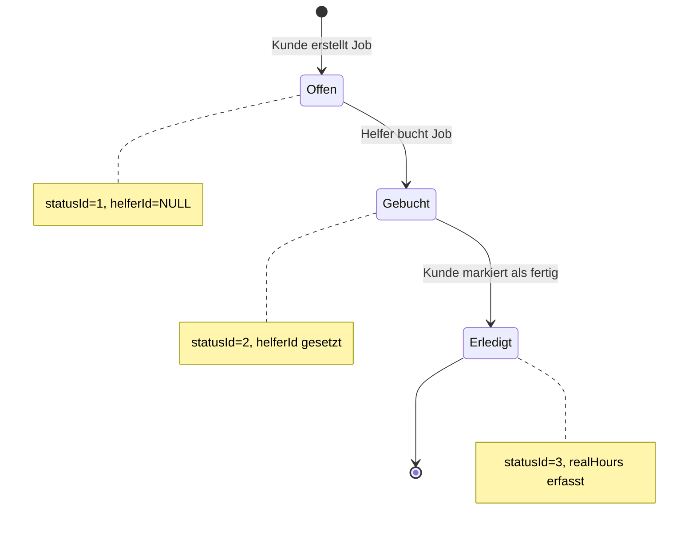

{: .label }
Malin Schütz

{: .no_toc }
# Architecture

{: .text-delta }

Table of contents

+ ToC
{: toc }

## Overview

Helferbär ist eine Flask-basierte Webplattform für Menschen ab Pflegegrad 1, hier Kunden genannt und Alltagshelfern. Kunden können Stellenagebot erstellen, während Helfer diese dursuchen, filtern und buchen können. Beide Benutzergruppen können auf ihrem Dashboard ihr Jobs mit Statusanzeige sowie ihre monatlichen Stunden tracken. Nach Abschluss markiert der Kunde den Job als erledigt und erfasst die tatsächlich gearbeiteten Stunden.  
Technisch basiert die WebApp auf Flask und Python sowie SQLAlchemy für ORM, WTForm für die Formularvalidierung und Bootstrap für die UI-Frameworks.

## Codemap

Die App folgt einer klassichen Flask-Struktur mit klarer Trennung zwischen Routen, Datenmodell, Forms und Templates.

**app.py** ist das Herzstück der Anwendung und enthält sämtliche HTTP-Routen. Es gibt für jede Nutzergruppe eine Login- und Registrierungsroute (``/helfer/anmelden``, ``/helfer/registrieren``, ``/kunde/anmelden``, ``/kunde/registrieren``), rollenspezifische Dashboards (``/kunde``, ``/helfer``) und alle Job-Management-Funktionen, vom Erstellen über das Filtern und Buchen bis zum Markieren als erledigt (z.B. ``/helfer/job_buchen/<int:job_id>`` oder ``/kunde/job/<int:job_id>/done``).  
Die Routen unterscheiden unterscheiden explizit zwischen GET- und POST-Requests: GET-Requests rendern Templates mit Daten (z.B. ``/kunde`` lädt Jobs via ``current_user.get_jobs_by_status_kunde()`` aus der DB und übergibt diese an das Template), während POST-Requests Formulardaten verarbeiten und DB-Änderungen durchführen (z.B. ``/kunde/stellenangebot`` validiert StellenangebotForm und erstellt einen neuen Job der via Commit in der DB gespeichert wird).  
Zusätzlich implementiert die API-Route `/api/hours/<int:user_id>` eine headless JSON-Schnittstelle die z.B. von der Helferbär Buchhaltung für die Abrechnung der Stunden genutzt werden kann. Via Query-Parameter `year`/`month` (optional, Default = aktueller Monat) das Stundenkonto eines Users aggregiert und strukturiert in einer JSON-Datei zurückgibt.

**db.py** definiert das Datenmodell. Es gibt 4 Entitäten:  
``User`` (erbt von UserMixin für Flask-Login) speichert Profildaten wie Name Geburtsdatum und Rolle ('kunde' oder 'helfer'). Besonders wichtig sind die beiden Relationships, die ``User`` mit ``Job`` verbindet. Mithilfe von ``jobs_created`` zeigt alle Jobs, die ein User mit der Rolle Kunde erstellt hat (aufrufbar über ``Job.kundeId``), während ``jobs_taken`` alle Jobs enthält, die ein Helfer gebucht hat (aufrufbar über ``Job.helferId``). Diese Beziehungen funktionieren dank ``back_populates`` in beide Richtungen.  
``User`` enthält außerdem mehrere Hilfsmethoden. ``get_month_hours_kunde`` und ``get_month_hours_helfer`` brechnen dynamisch die Stunden des ausgewählten Monats, während die Methoden ``get_jobs_by_status_kunde()`` und ``get_jobs_by_status_helfer()`` die jeweiligen Jobs der Kunden und Helfer aus der DB laden und für die Dashboard-Anzeige gruppieren.  
Außerdem gibt es noch die Entität ``Job``, die alle relevanten Jobdaten enthält (z.B Beschreibung und Datum) sowie die Foreign Keys ``kundeId``, ``helferId``, ``statusId`` und ``catId``.  
Die Entitäten ``Status`` und ``Category`` definieren die Zustände und Kategorien, die ein Job haben kann.

**forms.py** enthält alle WTForms-Klassen, die sowohl Validierung als auch CSRF-Schutz bereitstellen. Die ``LoginForm`` validiert Email-Format und ob ein Passwort eingegeben wurde, während ``RegisterForm`` auch Checks wie z.B. Mindestlänge für Name und Passwort oder Passwort-Bestätigung via ``EqualTo``-Validator durchführt. Die ``StellenangebotForm`` dient für die Erstellung von Stellenangeboten und hat z.B. ein ``SelectField`` mit drei vordefinierten Kategorien.
Die ``JobFilterForm`` ermöglicht Helfern das Filtern offener Jobs nach Freitext-Suche, Kategorie, PLZ (5-stellig) und minimalen Stunden, dabei ist der Input aller Felder optional.
Alle Formulare nutzen außerdem ein ``SubmitField``. 

**templates/** organisiert alle Jinja2-Templates. Alle Templates erben von ``base.html``. Diese stellt die Bootstrap-Navbar bereit. Die Links der Navbar ändern sich dynamisch je nach Benutzerrolle. Außerdem rendert ``base.html`` Flash-Messages mit Schließ-Buttons für Erfolgs- und Fehlermeldungen.  
Die Templates sind nach Rollen strukturiert: **Helfer-Templates** wie ``helfer_startseite.html`` zeigen das Dashboard mit gebuchten und erledigten Jobs sowie das Stundenkonto des aktuellen Monats, ``helfer_stellenangebote.html`` zeigen eine Suchmaske sowie offene Jobs mithilfe von Bootstrap-Cards inklusive Buchen-Button und über ``helfer_kunde_profil.html`` können Kundendetails eingesehen werden. Die **Kunden-Templates** sind identisch aufgebaut, wobei ``kunde_stellenangebote`` natürlich das Formular rendert, um ein Stellenangebot aufzugeben.  
**Login/Register-Templates** (z.B. ``helfer_anmelden.html``, ``kunde_registrieren.html``) sind rollenspezifisch getrennt, rendern aber identische Forms mit unterschiedlichen Überschriften. Die index.html dient als Startseite mit Buttons für Helfer/Kunden-Registrierung. 

## Cross-cutting concerns

Dieser Abschnitt beschreibt Aspekte, die für das Verständnis der Anwedung zentral sind, unabhängig davon, in welcher Datei sie implementiert sind.

### Authentifizierung und Autorisierung

Die App nutzt Flask-Login für Session-Management und Flask-Bcrypt für Passwort-Hashing. Jeder Request lädt den User-Zustand automatisch neu aus der Datenbank mithilfe der Methode ``load_user(user_id)``, die ``db.session.get(User, int(user_id))`` aufruft. Beim Login wird das eingegebene Passwort mit ``bcrypt.check_password_hash(user.password, form.password.data)`` mit dem gespeicherten Hash validiert.  
Alle geschützten Routen verwenden den ``@login_required``-Decorator. Zusätzlich prüfen rollenspezifische Routen explizit ``current_user.role``. Versucht ein Helfer auf ``/kunde`` zuzugreifen, wird er ausgeloggt und zur Index-Seite umgeleitet.

### Job-Lebenszyklus und Status-Management

Jobs durchlaufen drei Zustände, die über ``statusId`` gesteuert werden:

**Status-Übergänge:**
- Offen -> Gebucht: POST-Request in ``/helfer/job_buchen/<int:job_id>`` setzt ``job.helferId=current_user.userId`` und ``job.statusId=2``
- Gebucht -> Erledigt: POST-Request in ``/kunde/job/<int:job_id>/done`` setzt ``job.statusId=3`` und erfasst ``job.realHours``

### Stundenkonto
Die Methoden ``get_month_hours_kunde`` und ``get_month_hours_helfer`` berechnen dynamisch die Stunden des ausgewählten Monats. Sie filtern Jobs zwischen dem 1. des ausgewählten Monats und dem 1. des Folgemonats.  
Für Kunden werden drei Kategorien gebildet: offene Stunden (Jobs mit ``statusId=1``, Column ``hours``), gebuchte (Jobs mit ``statusId=2``, Column ``hours``) und erledigte (Jobs mit ``statusId=3``, Column ``realHours``). Bei Helfern werden nur die Kategorien gebuchte und erledigte Stunden gebildet.

### Template-System für wiederverwendbare Stellenangebote

To-Do

