{: .label }
Malin Schütz

{: .no_toc }
# Reference documentation

<details open markdown="block">
{: .text-delta }
<summary>Table of contents</summary>
+ ToC
{: toc }
</details>

## Authentifikation

### `helfer_anmelden()`

**Route:** `/helfer/anmelden`

**Methods:** `GET` `POST`

**Purpose:** Rendert Login-Formular für Helfer (`GET`) und authentifiziert User mit Email und Passwort (`POST`). Bei Erfolg wird User mithilfe von `login_user()` eingeloggt und zu `/helfer` weitergeleitet. 

**Sample output:**

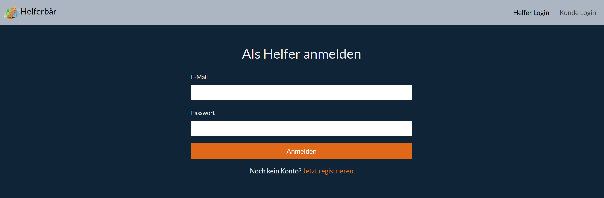

---

### `kunde_anmelden()`

**Route:** `/kunde/anmelden`

**Methods:** `GET` `POST`

**Purpose:** Identisch zu `/helfer/anmelden`, aber für Kunden-Rolle. Redirect nach Login zu `/kunde`.

**Sample output:**
 
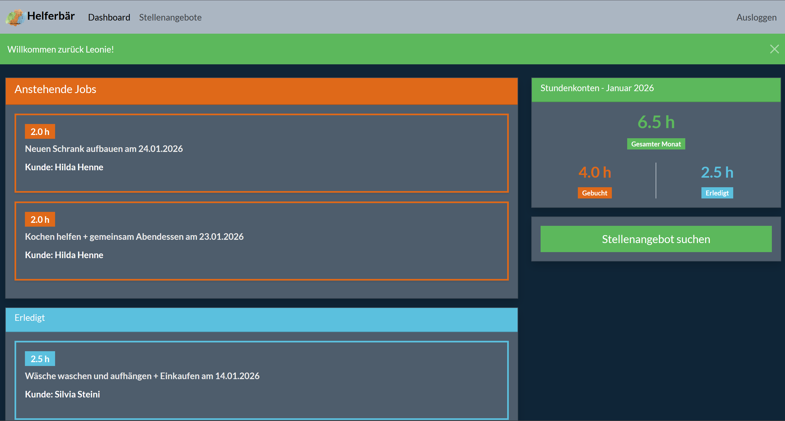

---

### `helfer_registrieren()`

**Route:** `/helfer/registrieren`

**Methods:** `GET` `POST`

**Purpose:** Rendert Register-Formular für Helfer (`GET`). Erstellt neuen User mit `role='helfer'`, loggt User nach erfolgreicher Registrierung mithilfe von `login_user()` ein und leitet zu `/helfer` weiter (`POST`).

**Sample output:**

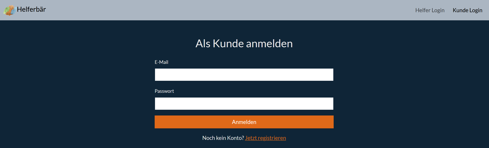

---

### `kunde_registrieren()`

**Route:** `/kunde/registrieren`

**Methods:** `GET` `POST`

**Purpose:** Identisch zu `/helfer/registrieren`, aber für Kunden-Rolle. Redirect nach Registrierung zu `/kunde`.

**Sample output:**

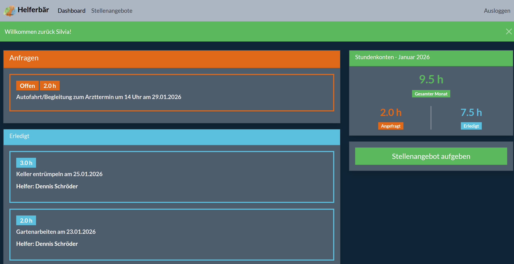

---

### `logout()`

**Route:** `/logout`

**Methods:** `GET` 

**Purpose:** Beendet aktuelle User-Session und leitet zur Startseite weiter.

**Sample output:**

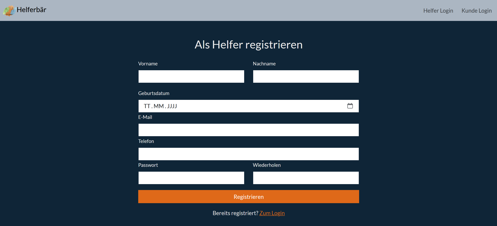

---

## Kunden-Funktionen

### `kunde()`

**Route:** `/kunde/`

**Methods:** `GET` `POST`

**Purpose:** Zeigt Kunden-Dashboard mit drei Bereichen: Offene/gebuchte Anfragen, erledigte Jobs und Stundenkonto. `GET`rendert Stundenkonto für den aktuellen Monat oder via Query Parameter `year`/`month`für ausgewählten Monat. `POST`verarbeitet die Monatsnavigation über Vor/Zurück-Pfeile. Nur für eingeloggte Kunden zugänglich.

**Sample output:**

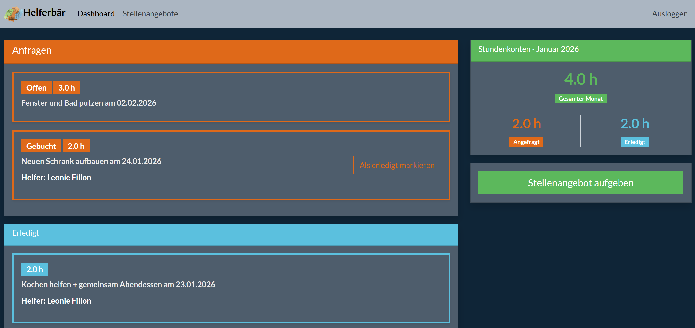

---

### `kunde_stellenangebot()`

**Route:** `/kunde/stellenangebot`

**Methods:** `GET` `POST`

**Purpose:** Rendert Formular zum Erstellen neuer Jobs (`GET`). Speichert Jobs mit `statusId=1` (offen) in DB und verknüpt `current_user.userId` als `kundeId` (`POST`). Optional als Vorlage speicherbar (`isTemplate=True`)

**Sample output:**

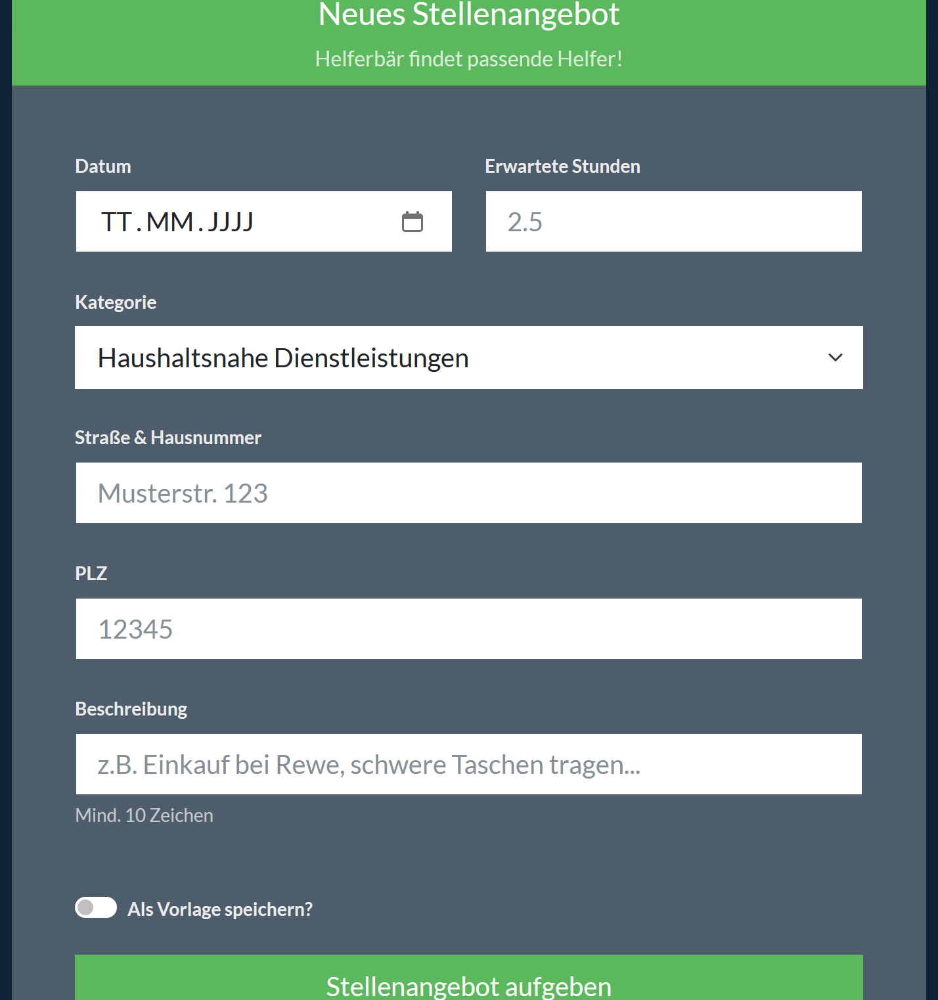

---

### `kunde_job_erledigt()`

**Route:** `/kunde/job/<int:job_id>/done`

**Methods:** `POST`

**Purpose:** Setzt Job-Status auf 3 (erledigt) und erfasst tatsächlich gearbeitete Stunden (`realHours`).

**Sample output:**

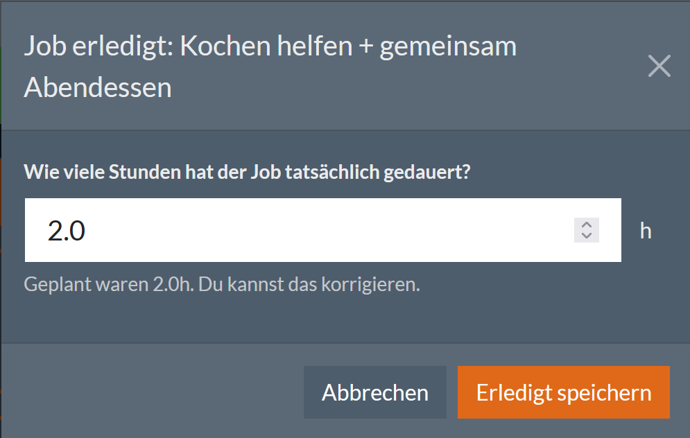

---

### `kunde_helfer_profil()`

**Route:** `/kunde/helfer_profil/<int:helfer_id>`

**Methods:** `GET`

**Purpose:** Zeigt Profil eines Helfers für den Kunden an. Nützlich für den Kunden um zu erfahren, wer der Helfer ist, wie lange er schon Alltagshelfer ist und ob schon gemeinsame Jobs erledigt wurden.

**Sample output:**

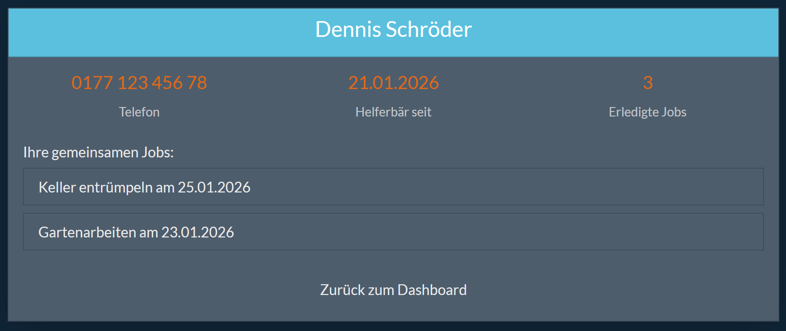

---

## Helfer-Funktionen

### `helfer()`

**Route:** `/helfer/`

**Methods:** `GET` `POST`

**Purpose:** Zeigt Helfer-Dashboard mit drei Bereichen: Gebuchte Anfragen, erledigte Jobs und Stundenkonto. `GET` rendert Dashboard für den aktuellen Monat oder via Query-Parameter `year`/`month`für ausgewählten Monat. `POST`verarbeitet Monatsnavigation über Vor/Zurück-Pfeile. Nur für eingeloggte Helfer zugänglich.

**Sample output:**

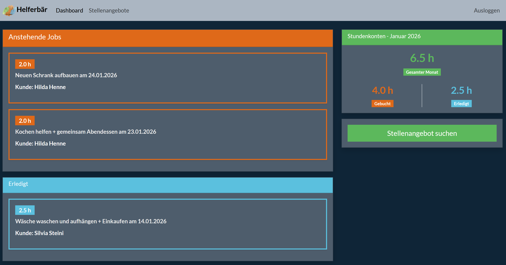

---

### `helfer_stellenangebot()`

**Route:** `/helfer/stellenangebot`

**Methods:** `GET` `POST`

**Purpose:** Listet alle offenen Jobs (statusId=1) mit optionaler Such-/Filterfunktion. GET zeigt ungefilterte Liste, POST wendet Filter aus `JobFilterForm` an (Freitext-Suche, Kategorie, PLZ, minimale Stunden).

**Sample output:**


---

### `helfer_job_buchen()`

**Route:** `/helfer/job_buchen/<int:job_id>`

**Methods:** `POST`

**Purpose:** Bucht offenen Job für aktuellen Helfer. Setzt `job.helferId=current_user.userId` und `job.statusId=2`

**Sample output:**

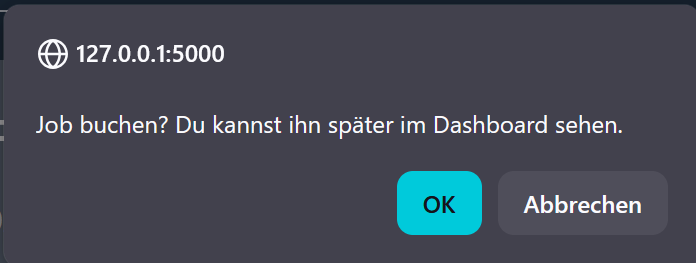

---

### `helfer_kunde_profil()`

**Route:** `/helfer/kunde_profil/<int:kunde_id>`

**Methods:** `GET`

**Purpose:** Zeigt Profil eines Kunden für den Helfer an. Nützlich für den Helfer um zu erfahren, wer der Helfer ist, wie lange er schon bei Helferbär angemeldet ist und ob schon gemeinsame Jobs erledigt wurden.

**Sample output:**

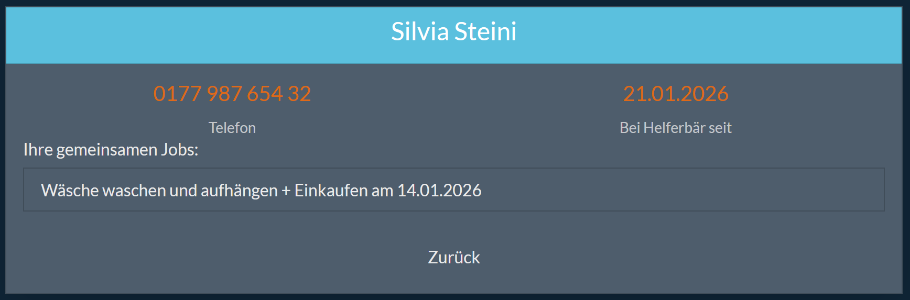

---

## Index

### `index()`

**Route:** `/`

**Methods:** `GET` `POST`

**Purpose:** Zeigt Startseite mit Auswahl ziwschen Helfer- und Kunden-Login bzw. -Registrierung (`GET`). Verarbeitet Button-Klicks und leitet zu entsprechenden Routen weiter (`POST`).

**Sample output:**

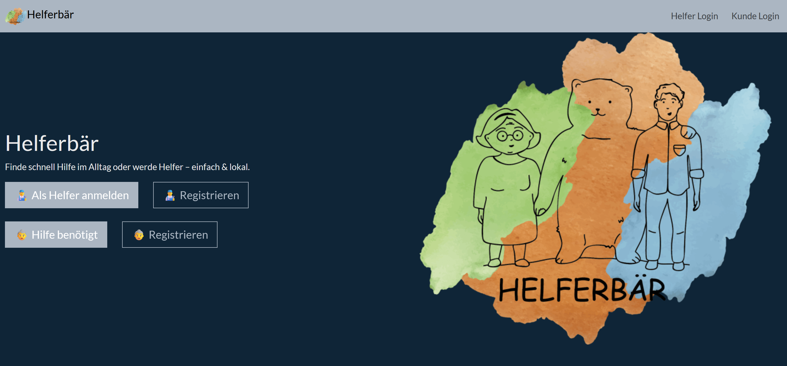

---

## API Stundenkonto (JSON)

### `api_hours(user_id)`

**Route:** `/api/hours/<int:user_id>`

**Methods:** `GET`

**Purpose:** Liefert Stundenkonto-Übersicht als JSON. Nützlich zum Beispiel für Abrechnungen. Query-Parameter `year`/`month` sind optional (Default: aktueller Monat).

**Sample Output:** 
```json 
{
 "userId": 1, 
 "role": "helfer", 
 "firstName": "Leonie", 
 "name": "Fillon", 
 "period": "2026-01", 
 "hours": { "gebuchte": 4.5, "erledigte": 8.0, "gesamt": 12.5 } 
 }
 ```